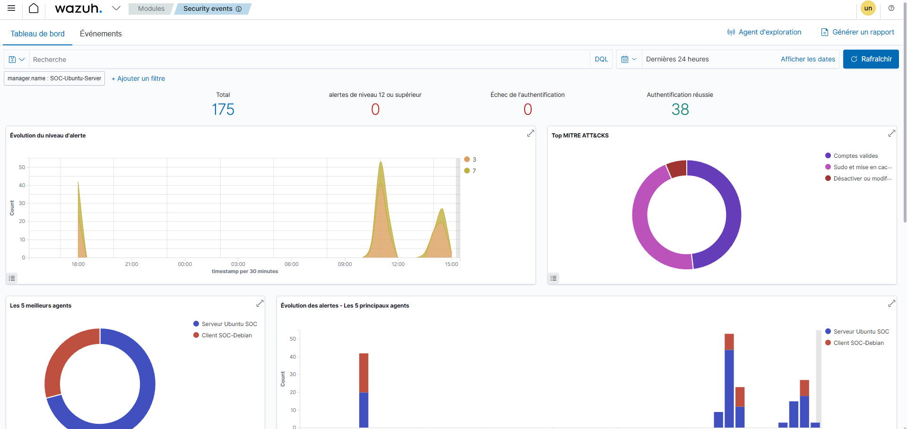

# SOC Lab - Wazuh SIEM avec VirtualBox



## Présentation

Ce projet consiste à concevoir un laboratoire SOC (Security Operations Center) virtuel afin de découvrir le fonctionnement d'un SIEM (Security Information and Event Management) avec Wazuh.

L'objectif est de centraliser les événements de sécurité provenant d'une machine cliente et de les visualiser dans un tableau de bord.


---

## Architecture

Le laboratoire est composé de trois machines virtuelles sous VirtualBox.

| Machine | Rôle |
|----------|------|
| Ubuntu Server | Wazuh Manager + Dashboard |
| Debian Client | Agent Wazuh |
| Kali Linux | Machine d'attaque et de test |

```
                 +----------------------+
                 |   Kali Linux         |
                 | Machine d'attaque    |
                 +----------+-----------+
                            |
                            |
                    Réseau VirtualBox
                            |
        +-------------------+-------------------+
        |                                       |
+-------+--------+                    +---------+--------+
| Ubuntu Server  |                    | Debian Client    |
| Wazuh Manager  |<------------------>| Agent Wazuh      |
| Dashboard      |                    | Journaux système |
+----------------+                    +------------------+
```

---

## Technologies utilisées

- VirtualBox
- Ubuntu Server 22.04
- Debian 13
- Kali Linux
- Wazuh 4.7.5
- OpenSearch Dashboard
- SSH
- Nmap

---

## Fonctionnement

Le serveur Ubuntu héberge :

- Wazuh Manager
- OpenSearch
- Dashboard Wazuh

Le client Debian envoie ses événements de sécurité au Manager grâce à l'agent Wazuh.

Kali Linux permet de générer du trafic réseau (Nmap, Ping...) afin d'observer les événements dans le SIEM.

---

## Fonctionnalités validées

✔ Installation du Manager

✔ Installation du Dashboard

✔ Installation de l'agent Debian

✔ Enregistrement de l'agent

✔ Communication entre les machines

✔ Visualisation des événements

✔ Tableau de bord Wazuh opérationnel

✔ Scan Nmap depuis Kali

---

## Exemple de test

Depuis Kali :

```bash
nmap -A 192.168.8.149
```

Résultat :

- Détection du service SSH
- Analyse du système cible
- Génération d'événements visibles dans Wazuh

---

## Résultat

Le laboratoire permet :

- la centralisation des journaux
- le suivi des agents
- l'analyse des événements de sécurité
- la visualisation des tableaux de bord Wazuh

---

## Auteur

Projet personnel réalisé dans le cadre d'un apprentissage en cybersécurité (SOC / SIEM).
